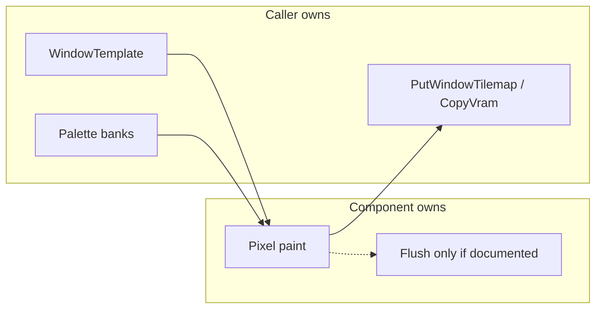

# Reusable UI components — design principles

How to shape the next shared painter so it survives a second host (MAKEOVER, Debug Menu, summary, gallery) without rediscovering GBA footguns.

Incident log: [ui-common-problems.md](../ui-common-problems.md). Call recipes: [ui-components.md](../ui-components.md). Screen bootstrap: [custom-screen.md](../custom-screen.md).



---

## 1. Ownership contract

Same split as scrollbar / framed panel / [custom-screen.md](../custom-screen.md):

| Caller owns | Component owns |
|-------------|----------------|
| `WindowTemplate`, BG/OBJ setup, DISPCNT | Painting into that window |
| Palette **bank** loads (`LoadStdWindowGfx`, `TypeIcon_LoadPalette`, theme apply) | Which **indices** it paints with (documented) |
| When to `PutWindowTilemap` / `CopyWindowToVram` | Optional `Flush` / `Show*` **only if the header says so** |
| Lifetime (create/destroy windows, tasks, sprites) | No hidden global screen state |

If a helper both paints **and** maps/copies, name it (`Flush`, `ShowText`) and document that it assumes the caller has not already mapped conflicting tilemap state.

---

## 2. Happy path vs escape hatch

Design for the **primary host** first; don’t make every caller pay for the hardest host.

| Pattern | Example |
|---------|---------|
| Prefer when possible | **Same-pal type window** — `TypeIcon_Draw` / `DrawBlank` / `BlitMenuInfoIcon`, idx 0 punches through (Moves, Skills detail HP) |
| Happy path (shared themed window) | `TypeIcon_Blit` / `BlitBlank` / `DrawHiddenPower*Block` → UiTheme fill as surround (MAKEOVER) |
| Escape hatch | `*WithSurround(…, rgb15)` for foreign shared canvases |
| Defaults + presets | `StatRadar_SetDefaults` + `ApplySizePreset` (+ optional `labelRadius`) |
| Explicit inject | `LoadBgPalSlots` when the host bank isn’t a theme |

**Rule:** escape hatches take **explicit RGB15 or semantic inputs**, never “whatever is at host pal index 1.” Index meanings are per-bank. Opaque surround cannot match striped chrome — prefer a same-pal window there.

---

## 3. GBA constraints that must leak into the API

Do not hide these behind “it just works” — encode them in names, aligns, and comments:

1. **8×8 tile grid** — palette override and many blits are tile-scoped; expose `AlignX` / align Y or require tile-aligned args (TypeIcon snaps Y down silently — callers should pass tile-aligned coords).
2. **BG palette index 0 is transparent** — never “clear to 0 + patch color 0” for a visible pad on mixed-palette BGs; on a **same-pal type window**, idx 0 punch-through is the intended stripe look.
3. **Chroma keys** — many assets use `RGB_MAGENTA` at pal idx 0. Sampling `[BG_PLTT_ID(n)]` alone is unsafe; prefer skip-0 pickers (`SurroundFromBgPal`) and sanitize inside blit.
4. **Per-tile palette override** — leftover pixels in an override rect remapped through the foreign bank → fringe / wrong text colors. Fill the whole rect before color-key blit. Override height ≥ `ceil(artH/8)` tiles (12px badge → 16px pad).
5. **4bpp nibble packing** — multi-color plotters pass **raw** indices 0–15, not `PIXEL_FILL(n)` (see StatRadar / ui-components gotchas).
6. **`StatRadar` `labelRadius`** — `scalePercent` shrinks drawn cage only; set `labelRadius` to keep tip labels on a larger ring (Skills detail).

---

## 4. Draw protocol

Three valid shapes:

**Same-pal type window** — Moves / Skills detail HP:

```text
Load type pal (once if needed)
→ FillWindowPixelBuffer(typeWin, 0)
→ TypeIcon_Draw / BlitMenuInfoIcon
→ PutWindowTilemap(typeWin)  // after shared canvases if they overlap screen space
→ CopyWindowToVram
```

No surround, no override. Idx 0 shows page chrome (stripes OK).

**Split (foreign palette on a shared window)** — TypeIcon mixed-palette:

```text
Load type pal (once at screen init)
→ paint pixels (tile-align, surround fill, color-key blit)
→ other painters on the same window (radar, text) if needed
→ PutWindowTilemap(window)
→ ApplyPaletteOverride(badge rect) / TypeIcon_Commit
→ CopyWindowToVram (FULL, or MAP then GFX if the screen already splits them)
```

Document this order in the **header**. Wrong order = theme colors on the badge or wiped override. Remount (`PutWindowTilemap` again) requires re-`Commit`.

**One-shot (component owns chrome)** — FramedPanel `ShowEmpty` / `ShowText`: reset + optional text + flush. Fine when the window’s only job is that panel.

Prefer **same-pal** for badges on striped/foreign chrome when a small window is affordable; prefer split when the badge must share a themed canvas; prefer one-shot when the component **is** the window’s chrome.

---

## 5. Palette semantics

- **UiTheme** banks use named slots (`UI_THEME_IDX_FILL`, text, frame, …) — [ui-themes.md](../ui-themes.md).
- **Raw 0–15** on a host bank are only meaningful after that bank’s load (type pal, summary chrome, radar blues).
- Never assume idx **1** is “panel fill.” Summary Moves memo: idx 1 = radar blue.
- Never assume idx **0** is a visible surround color.

---

## 6. Refresh policy

| Situation | Do |
|-----------|----|
| Open page / theme change | Full chrome reset (`FramedPanel_Reset`, reload pals) |
| Slider tick / live EV update | Content-only fill + reprint + `COPYWIN_GFX` / `FULL` — **no** frame rebuild |
| Badge after radar | Draw badge **last** in the shared rect (or reserve an exclusive rect) |

Expensive resets in a hot path = visible flash. Encode a cheap refresh path in the API or in the cookbook for that call site.

---

## 7. Domain vs paint

Pure data helpers (`TypeIcon_CalcHiddenPowerType`, etc.) may live next to painters in one `.c`, but:

- Group them clearly in the header.
- Don’t grow domain rules into blit (no “stretch pill + print HP name” inside core blit until a deliberate config exists).
- A second consumer of the math shouldn’t need the painter.

---

## 8. Proof hosts vs canonical hosts

| Role | Example | Rule |
|------|---------|------|
| Canonical (mixed-palette) | MAKEOVER footer TypeIcon | Keep working; docs recipes point here for surround/`Commit` |
| Canonical (same-pal) | Moves type column; Skills detail HP pill | Prefer this pattern for new summary hosts |
| Future proof | Debug component gallery | Presets + both TypeIcon paths side by side |

Don’t treat disposable proof layout as product UX.

---

## 9. DevX: “fix didn’t apply”

Palette/gfx bugs that “won’t die” are often a **stale `.o` / `.gba`**. After surround or pal tweaks, confirm build artifacts are newer than sources before chasing another theory. mGBA must reload the new ROM.

---

## 10. Component maturity checklist

Before calling a module “reusable”:

- [ ] Ownership written in the header (window / pal / map-copy).
- [ ] Happy path for the primary host; escape hatch for foreign hosts with explicit colors.
- [ ] GBA constraints named (align, idx 0, chroma key, override order) — not only tribal knowledge.
- [ ] Draw / refresh protocol documented; cheap path for live updates if needed.
- [ ] At least **two** hosts attempted, or one canonical + one disposable proof of the escape hatch.
- [ ] Pitfalls linked to [ui-common-problems.md](../ui-common-problems.md) when we already burned time.
- [ ] No silent dependency on “idx 1 = fill” or “pal[0] = panel color.”

---

## Case study: TypeIcon

**What we got right**

- Stock `menu_info` art + `pokemon_types` (no stretched letter garbage).
- **Procedural blank pills** (`DrawBlank*` / `BlitBlank*`): same silhouette + fills (incl. two-tone mid split) + `gTypeNames` / `FONT_SMALL`, without resampling bake.
- Label center = **white** ink AABB + leftover pads (agbcc-safe); offline parity via [`tools/preview_type_pills.py`](../../tools/preview_type_pills.py).
- Mixed-palette path: tile-align, unused idx **10** surround, color-key / surround corners, override after tilemap.
- Themed happy path vs `*WithSurround`.
- `SurroundFromBgPal` + sanitize against `RGB_MAGENTA`.
- Hidden Power IV helpers kept as data beside paint.
- **Same-pal window path** for Skills detail (and Moves): avoids opaque pad fighting striped chrome.
- MAKEOVER footer uses **blank** mixed-palette (live HP type); Skills can keep stock bake where pixel-identical vanilla matters.

**What still hurts**

- Shared canvases still need `PutWindowTilemap` before `Commit` (Commit does not map the whole window); remount wipes override.
- Opaque surround cannot match stripes — must use same-pal + idx 0 or accept a solid pad.
- Silent Y tile-snap makes 1px nudges jump by up to 7px — document / expose align helpers to callers.
- Foreign hosts need an explicit surround; easy to sample chrome idx 0 without `SurroundFromBgPal`.
- Preview vs ROM can diverge if origin math isn’t written agbcc-safe (signed `/` toward zero) — keep leftover-pad form + regenerate PNGs after C changes.

**API status**

1. Keep `TypeIcon_Blit` / `DrawHiddenPowerBlock` as themed mixed-palette happy path (stock bake) — done.
2. `BlitBlank*` / `DrawHiddenPowerBlankBlock*` for procedural pills — **done** (MAKEOVER footer).
3. Prefer `TypeIcon_Draw` / dedicated type window when the host is striped or foreign — **Skills detail done**; Moves was already this pattern.
4. Prefer `SurroundFromBgPal` / explicit RGB for foreign shared canvases; sanitize inside blit — done.
5. `TypeIcon_Commit` / `CommitSized` = override + optional VRAM copy — **done**. Still no `Show*` that also `PutWindowTilemap` (shared canvases own that).
6. `LoadPalette` once at init; blit only patches surround idx 10 — **done**.
7. Do **not** add stretched pills / ad-hoc “HP {name}” printers to core blit without a deliberate config.

Recipes and call sites: [ui-components.md](../ui-components.md) § TypeIcon. Pad / stripe / centering write-ups: [ui-common-problems.md](../ui-common-problems.md) §§3–4b.

---

## Rebuild baked assets as painters (when it pays off)

Vanilla FireRed ships a lot of **lettered / finished** UI sheets (`menu_info` type pills, move-info bars, etc.). Blitting them is cheap and pixel-perfect — until you need a live value, a different width, a theme, or a label the bake didn’t include. Stretching or OCR’ing those tiles is how we got ghost `PSYCHC` text.

**Prefer a reusable painter when most of these are true:**

1. The chrome is a **small silhouette** (pill, chip, bar) plus **fill + optional label**, not a full illustrative scene.
2. Call sites need **runtime data** (Hidden Power type, custom width, theme surround).
3. You can match stock with **palette roles + font** (e.g. `pokemon_types` idx 14/15 + `FONT_SMALL`) instead of new pixel art for every variant.
4. An **offline preview** can lock parity to the sheet before emulator loops (`preview_type_pills.py` pattern).

**Keep the bake when:**

- You need bit-identical vanilla on a same-pal window and never customize it.
- The asset is complex illustration (not a component).
- Procedural cost (measure glyphs, two-tone fills) isn’t worth one static blit.

**How to shape the rebuild**

| Bake piece | Procedural stand-in |
|------------|---------------------|
| Silhouette / corner cuts | Fill rect + corner idx (0 same-pal, surround mixed) |
| Body colors | Table of type → top/bottom fill indices (two-tone mid split) |
| Letters | `gTypeNames` (or caller string) + shared font blit; center on **ink**, not char count |
| Sheet preview | Tool that crops stock `.4bpp` beside your painter output |

TypeIcon blank pills are the template: stock path stays for Moves/Skills bake; blank path is the customizable component. When you eye the next sheet (`TYPE` / `POWER` bars, etc.), ask whether a painter + preview beats another frozen PNG.

### Done: generic chip core + TypeIcon preset

TypeIcon used to own both **GBA chip mechanics** and **type-pill policy**. Split:

| Layer | Owns | Lives in |
|-------|------|----------|
| Chip / shape core | W×H rect, 1px corners, solid/split fill, label + white-ink leftover-pad origin, same-pal vs mixed surround/`Commit` | [`ui_chip.c`](../../src/ui_chip.c) / [`ui_chip.h`](../../include/ui_chip.h) |
| TypeIcon preset | Type fills, `gTypeNames` / HP prefix, stock bake, HP calc; blank APIs wrap UiChip | [`type_icon.c`](../../src/type_icon.c) |
| Preview tools (next) | Any chip config → PNG; type sheet compare as one recipe | generalize `preview_type_pills.py` → `preview_ui_chip.py` |

Existing `TypeIcon_*` call sites unchanged (thin wrappers). New badges should call `UiChip_*` directly.
